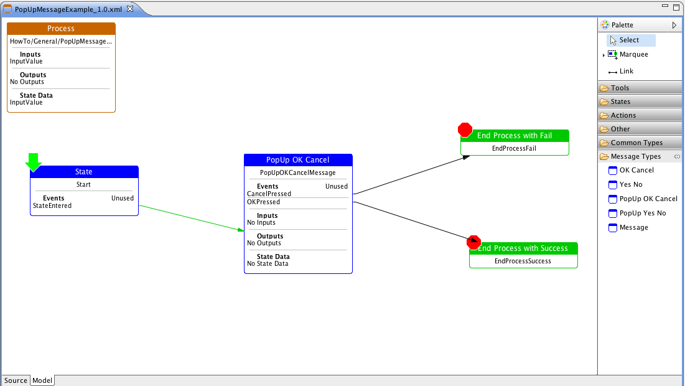
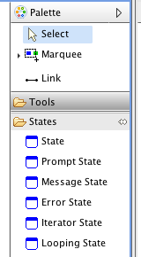
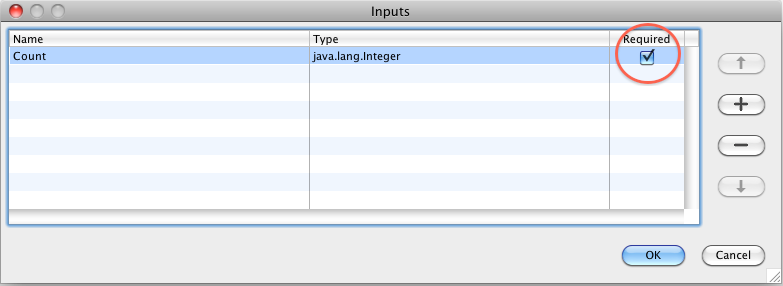
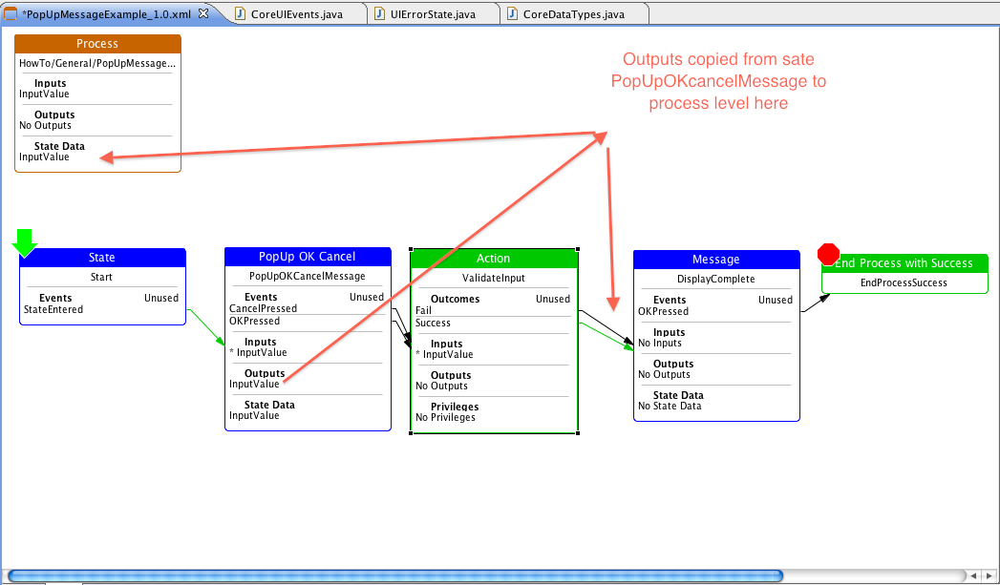
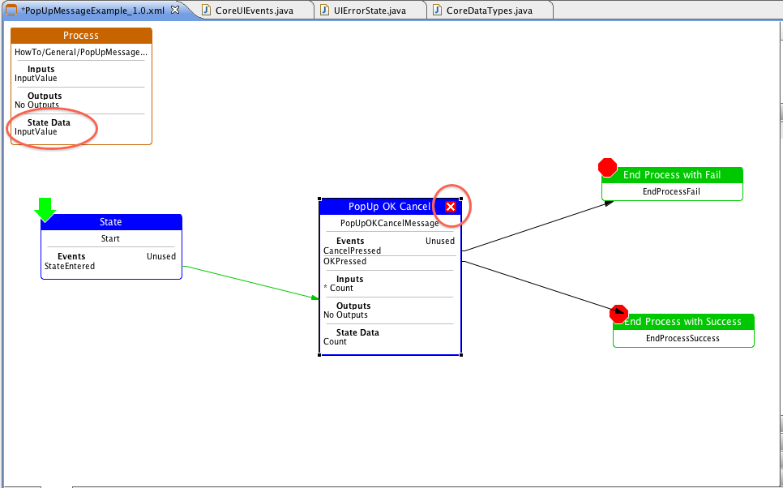
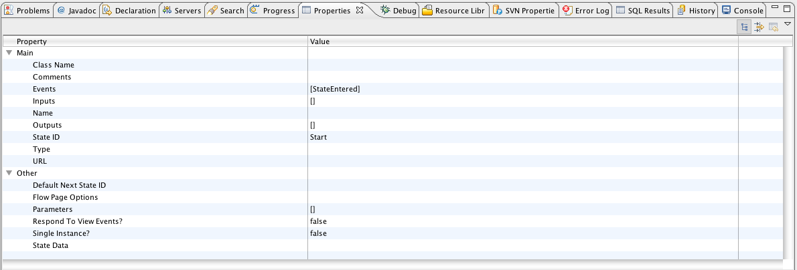
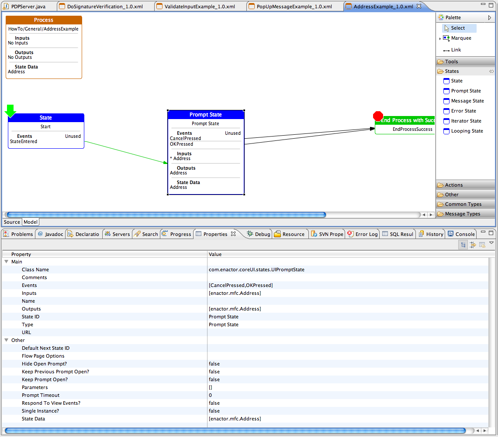
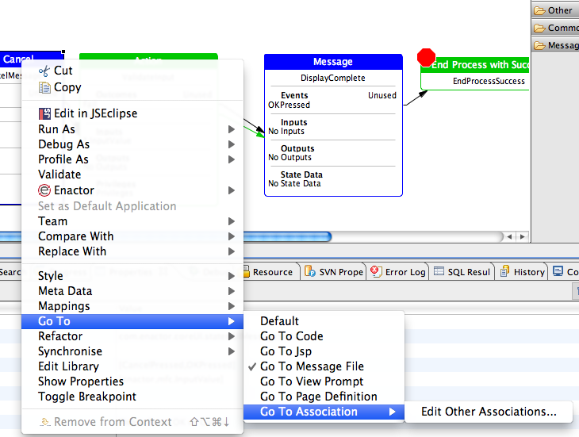

# States

## What are States ?

States are generally points in application processes where execution
pauses and the process waits for events. Events could be user input,
such as the press of a button, or events from devices, other processes
or from a communications channel such as queue or TCP socket. The system
waits for the event and then follows the link associated with the event
onto the next stage in the process diagram. States in Application
process diagrams are blue.

For example the state in the middle of the following simple UI process
represents a pop-up message with two buttons OK and Cancel. When one or
other is pressed then the UI generates either *OKPressed* or
*CancelPressed* events. Execution continues depending on the event
received:

{width="5.75in"
height="3.2395833333333335in"}

You will notice that there is also a state on the left of the diagram.
This has a single event coming out of it called *StateEntered* and
illustrates the other main use of states, which is not to pause, but to
divide up the process into specific stages. This is normally done in
order to organize the scope of variables passed between actions where it
putting everything at process level is undesirable. *StateEntered* is a
special event type that is executed straight away without pausing.

### Types of States

There are only a few types State, which can be seen in the tools
palette:

{width="1.0520833333333333in"
height="1.90625in"}

*State*

This represents a basic state which can respond to external events.
There is no UI associated with this type of state and it is generally
used together with the *StateEntered* event to organize processes into
logical sections. For example exceptions raised by actions can be
trapped at state level so that you don't have to have individual
exception handling for every action. Events from other threads and
application level events (called *View Events*) can also be responded to
at state level.

*Prompt State*

This represents a state where there is a UI prompt associated with the
state. The UI could be a web page or a local window or dialog. Behind a
prompt will be the code or definition that implements the screen or
dialog. This could be a jsp, javascript, some java code or a one of
Enactor's page definitions. If the prompt has been designed with
Enactor's (wireframe) page designer then double clicking a prompt state
will open up the designer and take you to the relevant screen associated
with sate.

*Message State*

Often it is rather cumbersome to build separate prompts for small
messages such as pop-up confirmations and OK cancel type dialogs.
Message states are used for these and there are number of pre-built
prompts in various UI technologies that support the different message
state types. For example: *OK Cancel, Yes No, PopUp OK* are examples of
these and it is possible to define a translatable message within the
state rather than having to adjust each dialog. Double clicking a
message state will take you to the message resource containing the
translatable message.

*Error State*

Error states are extensions of message states and report an error
message from the last exception raised in the process. The message
reported will come from the exception if it contains one otherwise the
message configured against the state will be used. It makes it possible
to report exception messages without having to define error messages for
each exception type. Double clicking an error state will take you to the
message resource containing the translatable message that will be used
if the exception does not contain one.

*\
*

*Iterator State and Looping States*

These are convenient ways of looping and iterating over lists in a
process. They are described in their own How To guide.

*Custom States*

Custom states can be created using Java and will be used if specified in
the Class Name property of the state's properties. Custom States need to
implement specific interfaces such as *IUIState* and *IUIPromptState* in
order to be able to be used by the framework.

## State Inputs, Outputs and State data

All states have input, output and state data. They are defined in a
similar way to process and action data and operate as described below.
You can access the dialogs for defining the data types either from the
*Properties* pane or by double clicking the labels *Inputs*, *Outputs*
or *State Data* that are displayed on the state symbol.

*Inputs*

Input data is initialized when a state is created and is taken from
process *State Data.* If a state defines a required input that is not
available at process level then an error symbol displays.

For example the input *Count* in the example below is flagged as a
required input:

{width="4.5in"
height="1.6354166666666667in"}

*Outputs*

Output data is saved to process level when the system moves onto the
next state. Note that this is not when an action is performed but when
another state is entered. In the above example the state *Start* is left
when the state *PopUpOKCancelMessage* is entered. The state
*PopUpOKCancelMessage* is only actually left when the process is ended.

In the following example the *PopUpOKCancelMessage* state is left when
the action ValidateInput has finished and the state *DisplayComplete* is
entered:

{width="5.760416666666667in"
height="3.375in"}

*State Data*

State data is initialized from input data when the state is first
entered and then is available to actions that are run by that state.
Actions can output to either process level state data or state level
state data. When a state completes it is the values of its state data
that become the output values. Consequently it is not possible to define
an output type that is not also state data type.

With prompt states types and message and error state types it is the
state's state data values that are made available to the UI.

## Validation of States in the Designer

The handling of Events and the definition of Inputs and Outputs are
validated by the designer and if inconsistencies or missing handling is
detected then the designer will flag the state symbol with an error in
the op righthand corner.

For example in the case below an input to a state has not been defined
that has not been satisfied. State input variables are automatically
mapped to from process level State Data variables or from the output of
previous states. If the names or types of the variables do not match
then an error is shown.

{width="5.46875in"
height="3.4270833333333335in"}

## Basic State Properties

Selecting a state with a single mouse click will show some information
about it in the Eclipse Properties pane. If this is not displaying then
on the main menu bar go to: *Window -- Show View -- Properties*. For
example:

{width="5.75in"
height="1.9479166666666667in"}

Looking at the properties of a state there are some key values that
explain how the system operates. The list below is the set that is
common to all states. More specialized state types have additional
properties.

The *Class Name* defines what Java class implements the state
functionality. This can be used to execute custom state execution code
although we have rarely found that this has been needed. It is always
best to try and put code in actions rather than states and use the built
in 6 state types.

*Comments* can be added as notes. These are saved with the diagram and
are optional.

*Events* is the list of events that can be raised by the state. Events
come from the UI, such as *OKPressed*, from hardware devices and also
from other processes. For example an action called *UISendEventAction*
will send events through to processes states that have *Respond To View
Events ?* set.

*Inputs* is the list of inputs to the state. They are populated from
process level *State Data*.

*Name* is a readable name for the process. Normally however the StateID
is enough. Filling in a *Name* is optional.

*Outputs* is the list of outputs from the state. They are copied to
process level *State Data* when the state exits -- just before entering
a new state or ending the process.

*StateID* identifies the state in the process. It is generally a good
idea to us logical names but with no spaces. You can use capitals to
separate words e.g. "PromptForUser" or "RunValidation".

*Type* is the type of state symbol. Different types of state have
slightly different properties as defined by the *Type*. The type is
generally set when you drag on a particular type from the palette.
However it is possible to change the type later by using this property
field.

*URL* defines a resource associated with a state. This is generally the
URL of a UI associated with the state -- for example the URL of a Page
Definition. For non-UI states such as a basic *State* type or a looping
state this will normally be blank.

*Default Next State ID* is an optional value that will be used to link
to if the state processes an event and there is no outcome link defined
for the event name that has been received. Note that this does not apply
to view events -- view events are ignored by a state unless there is an
explicitly defined event name that matches the name of the view event.

*Parameters* are values that are assigned to state inputs when the state
is created. Parameters can be edited by double-clicking on this field
and also by holding the Shift key down when double-clicking *Inputs* on
the state symbol. Parameters can be boolean (true/false) string, numeric
values or can use \${xxx} to get system properties.

*Respond to View Events* is a flag that enables this state to respond to
events raised by devices and other processes through the "*view*". The
*view* is a logical representation of the running part of the
application. In a graphical or web user interface environment views
represent the visible part of the application. In a background process
they represent the console, which may or may not be visible. Views and
events are described in other How to Guides.

*Single Instance* is a flag that means that only one instance of this
state will be made per process. This means that the state data inside of
the state will be retained if the state is left and then returned to
later. This is useful with user interface states and also states that
you want to sit listening for events, such as device or communication
events.

*State Data* is the list of variables that the state will hold
internally when it is active. When you add an input the designer
automatically adds it to the list of state data variables. You can only
output a variable from a state that is a *State Data* type as well.

### Examples of parameter values

The following are some examples of parameter values that can be defined
as inputs to states (and actions):

> *true* Boolean true
>
> *false* Boolean false
>
> *Hello World !* String
>
> *123456* Number

*Hello my name is {#{name}}* String

> #{null} Object
>
> *{name*} will be substituted by with the value of a variable such as
> *enactor.address.Name.*

Note that some actions such as the *UILogMessageAction* take in a
*LogMessage* string parameter which it will then substitute values into
with a reduced format:

*Hello my name is {name}*

### Prompt State Properties

*Prompt State* types add some additional properties that are relevant to
states that display a user interface. Prompt states display screens to
the user and respond to user input. Prompts can be pop-up windows or web
pages and can also use user interface elements that are on the main
application view.

Essentially *State Data* is the data that is made available to a prompt
and the possible user actions, such as button presses and up-down arrows
produce the events that are defined in the state's *Events* section. If
a user interface produces an event that is not declared on the state
symbol then an error results.

For example here is a state that displays an address and responds to an
OK or Cancel event from the user interface:

{width="5 760416666666667in"height="5.0625in"}

The following additional properties appear for prompt states:

*URL* is the identifier that the state uses to create the correct user
interface page or screen for the prompt. With a web page user interface,
such as a jsp or html page, the URL is the name of the web page
implementing the page. With a *Page Definition* based user interface
(Enactor's multi-UI screen designer) this is the id of the page
definition description file that describes the screen.

Note that Enactor supports situations where a given application process
can support different types of user interface. In this cas*e* the URL is
used as an identifier into a lookup file that we call a *View Prompt*
file. View Prompt files have the same name as the application process
that is running and have entries for each prompt url for that process.
Refer to the How To Guide on View Prompts for more information.

*Keep prompt Open* will keep the user interface prompt associated with
this state open even after the state is left. The normal behavior of
states and prompts is for a prompt to be destroyed when a state is left
and the next state entered. If you want to keep a prompt open because
you know that the process will be returning to it and you want to
preserve the prompt and state's data then checking this flag will
prevent it from being destroyed.

Note that setting this flag to true will also, by default, set *Single
Instance* to true. This stops another instance of the state and prompt
being created when the process returns to it. This is what is wanted in
most circumstances but can be overridden by setting *Single Instance*
off again.

*Hide Open Prompt* is a flag that is used together with *the Keep Prompt
Open* flag. Normally if a prompt is left open then it is kept visible.
Setting this flag will hide the prompt instead, but it will still be
present so that its variables will be preserved and will be made visible
if the process returns to it.

*Keep Previous Prompt Open* will stop the prompt associated with the
state just left (if it is a prompt, message or error state) from being
closed. When using this feature you need to think about potentially
using *Single Instance* on the prompt being left in order to prevent it
being recreated when the process goes back to it. However the special
behavior of Message and Error States, as described later on in this
guide, often makes this unnecessary since a Message or Error State
returning to a Prompt Sate that it came from will use the same instance
regardless of the status *of Single Instance* against the prompt being
returned to.

*Prompt Timeout* is a timeout value in seconds that can be set against a
prompt. If there is no user activity on the prompt for the duration of
the timeout period then an event is raised called *PromptTimeout*. This
enables processes to easily respond to no activity by a user.

### Message and Error State Properties

A common set of URLs are available for these state types that allow easy
use of built in message types. They are available as a drop down list in
the properties pane against the URL property field.

These state types also have additional fields that allow user text
messages to be configured so that separate screens do not have to be
produced for each message. A straight, non-translatable text can just be
typed into the *Message Text* field. Translatable texts are defined by
specifying a messages file and message id within the file.

*Message Base* specifies a messages file. If this is left blank then the
system will default to the *Message Base* property set against the
Application Process. Pressing ctrl and space in this field will bring up
a search dialog that will let you search for existing messages.

*Message ID* specifies the message within a messages file. Once a
message base has been specified then you can select a message in the
file from a drop down list against the field.

Double clicking the *Message ID* field will take you to the messages
file configured and pressing ctrl and space in this field will bring up
a search dialog that will let you search for existing messages.

If the system cannot link to a messages file then you will need to set
up a *Resource Mapping* in *Eclipse -- Preferences -- Enactor
Development -- Resource Mappings* so that the designers can find the
different message files in different projects.

### Additional points about Message and Error States

Message states and error states behave a little differently to normal
prompt states.

Firstly when returning to a prompt state from a message state we re-use
the existing instance of the prompt if it is still being displayed
without having to flag the prompt as *Keep Prompt Open* and/or *Single
Instance*. This is generally the behavior that is wanted when putting up
messages in response to something that a user has done previously in a
prompt and makes using messages and error messages a little easier.

Message States and Error States also return to the last state if there
are no links or default state set up. This enables them to be used at
process level for handling process level exceptions -- returning to
where they came from after putting up the message.

Both message states and error states raise a *WindowClosed* event as
*OKPressed* in the process diagram.

If an error state has an input defined of type *Exception* then it will
include the stack trace of the exception in the message.

## Associating User Interface files and designers with States

When working with states in application processes it is possible to
associate user interfaces designs and files with states. Once this is
done then double clicking a prompt state, for example, will take you
straight to the design for that prompt.

This is initially done by highlighting a state and using right-click:
*Go To -- Association -- Edit Other Associations...*

{width="3.65625in"height="2.75in"}

The most recently used association becomes the default.

