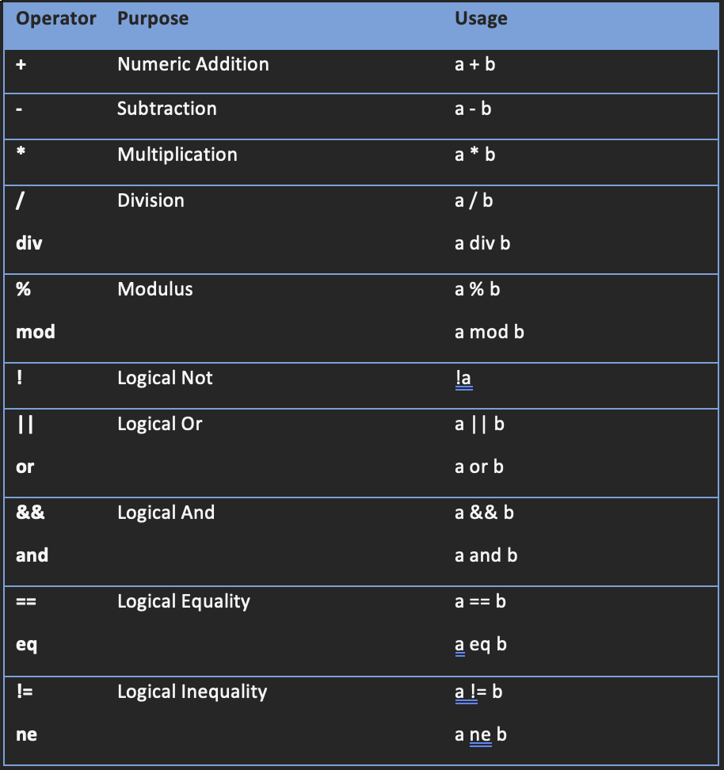

# Expression Language
This document describes the Expression Language (EL), used by the Enactor toolset to perform a number of different functions. It will discuss the syntax supported by EL, demonstrate how the use an expression builder and describe the use of EL within the different tools. The document also includes a reference of the functions available to EL (at the time of writing) with a brief description of their usage and arguments.

## How to use the Expression Language (EL)
EL is used extensively throughout the design tools including, but not limited to, the following areas:

- In the Application Process Editor
  - To support conditional links from Outcomes and Events
  - To support mappings on Inputs and Outputs from Actions or States
  - In Parameters to States and Actions
  - In Assign Actions, for the expressions on the assignments
- In the Page Definition Editor
  - To bind pieces of data to Page Elements
  - To provide support for dynamic control over visibility or other state of a Page Element
- In the Business Process Editor
  - For Parameters to Activities
  - For ‘If’ Activities

EL expressions are entered in the toolkit using an expression editor dialog, which shows the variables and functions that are available on the left hand side and the expression in a text area on the right:


## Expression Language Syntax
The Expression Language syntax used within the Enactor toolset shares much in common with the Unified Expression Language used within JavaServer Pages (JSPs) and JavaServer Faces (JSF). Therefore if you already have a good understanding of that, you will find development using the Enactor EL very familiar. However there are a few extensions to the EL language that are unique to the Enactor EL parser, including resolution of System properties, and how to extend functions.

#### *Method Name Requirements*
EL has a very simple syntax that is used to access methods and data on Java object using their Bean methods. Therefore for EL to bind to a Java method, it must follow the standard Java Bean conventions:

- For reading data from a Java Bean:
  - If the return type is boolean, the method name must be called either get ***YourPropertyName***, is ***YourPropertyName*** or has ***PropertyName***
  - Otherwise the method name must be called get ***PropertyName***
  - The ***PropertyName*** must begin with an upper case character.
  - The method cannot take any arguments.
- For writing data to a Java Bean:
  - The method must be named set ***PropertyName***
  - The method must take a single argument.
  - The ***PropertyName*** must begin with an upper case character.
- For properties which are to be both read from and written to:
  - All the above constraints apply, with additional constraint that the class of the return type for the getter method must be the same as the class for the argument to the setter method.


In general, you should also ensure you do not overload java class methods that are intended to be used by EL.

EL additionally supports binding to methods with other method prototypes; this feature is not currently used within the Enactor toolset.

#### *Resolving the Root Object*

Most EL expressions will involve some external data in the form of context. The source of this data is determined when the EL expression is invoked, and is therefore variable depending upon the scope of the call. Later sections will describe the different data that is available depending upon the purpose of the expression.

When data is associated with an Application Process Data Type, the data will be supplied to the EL context with a ‘short name’ to allow easy access. The short name is derived from the full name of the Application Process Data Type by taking the last dot-separated piece and then changing the first character to lower case; as shown in the following examples:


<!-- |**Full Name**|**Short Name**|
| :- | :- |
|**enactor.coreUI.User**|User|
|**enactor.commonUI.XMLContent**|xMLContent|
|**enactor.customerOrders.Customer.Order**|Order| -->


#### *Referring to simple properties via EL*

*Expression Language uses a very simple ‘dot’ notation to refer to properties that takes the following form:*

*rootObjectName.property1.property2.property3*

*The rootObjectName is the name of the object that should form the beginning of the path used to bind the data. EL will then invoke the appropriate getter/setter method on that object to resolve the final property. For example, if the above were to be used to retrieve data, EL would perform the following functions:*

1. *It would first resolve the root object (more on this later) identified by the name rootObjectName.*
2. *It would then invoke the getProperty1 method on that object.*
3. *It would then invoke the getProperty2 method on the result of the call to getProperty1*
4. *Finally it would invoke getProperty3 on the result of the call to getProperty2*

*If at any point along the path a property resolves to null, the entire path resolves to null, i.e. if getProperty1 returned a null value, EL would not attempt to invoke getPropety2 and the path would resolve as null.*

*EL uses a very simple scheme to decide which method to invoke given a property name, by converting the first character to upper case and then finding the appropriate get or set method using the appropriate Java Bean rules described above. The following table demonstrates some simple examples:*


<!-- |***Method Name***|***Property Name***|
| :- | :- |
|***getSimpleProperty***|*simpleProperty*|
|***getXMLProperty***|*xMLProperty*|
|***getXMLPropertyWithDATA***|*xMLPropertyWithDATA*| -->

#### *Referring to indexed properties via EL*
If the root object, or a getter method returns an Array, or an instance of *java.util.List*, you can access any element within that Array/List using square brackets:

*rootObjectName.property1[5]*

In this example, *getProperty1* on the root object returns a list, and EL will then use the fifth element in that list. If the list does not contain enough elements, an *ArrayIndexOutOfBounds* exception will be raised.

To refer to child properties of the indexed element, simply continue to use the dot notation:

*rootObjectName.property1[5].property2*

Or if the property returned is another list you can continue to use the square bracket notation to access elements of the list:

*rootObjectName.property1[5][2]*
####
#### *Referring to map properties via EL*
If the root object, or a getter method returns an instance of *java.util.Map*, you can access any element in the map using the same square bracket notation:

*rootObjectName.property1[someKey]*

In this case, EL will invoke the getProperty1 method on the root object, and then use the value on the map associated with the *someKey* string key.

If the map is not keyed by a string, or other primitive, you can use another EL path as the value for the key:

*rootObjectName.property1[anotherObject.keyToUse]*

For this example, EL will first call the *getKeyToUse* method on the object *anotherObject*, it will use the result of this method to find the value within the map returned by *getProperty1* on the root object.

#### *Dynamic Binding*

EL also allows the binding to be semi-dynamic, in that you can use the value of one EL to determine which property to bind to on another path, again using the square bracket notation:

*rootObjectName[anotherObject.propertyToUse]*

In this case, if the root object is not a map, and *anotherObject.getPropertyToUse* returns a string value, EL will attempt to find an appropriately named property on the root object. For example, if *anotherObject.getPropertyToUse* returned the string *property1*, EL will bind to the *getProperty1* method on the root object.

You can also use constant string values in this manner to bind to properties, however for clarity it is better to always use the regular dot notation.

#### *Calling Utility Functions*

Enactor adds in a number of built-in functions, and these can be extended to define more as your own requirements grow. All functions, apart from the in the ‘simple’ functions list must include a ‘prefix’ that describes which function library the function is defined in. To use a function within an EL expression, use the following syntax:

*isEmpty(rootObject)*

This simple example would invoke the *isEmpty* function in the simple function library, passing it the object associated with the name *rootObject*. To call a function in a different library, use the notation:

*format:formatDDMMYY(rootObject.dateValue)*

This example would resolve the value of the *getDateValue* method on the object *rootObject*, and then pass the result to the *formatDDMMYY* method in the *format* function library.

Functions can return values, which can be used within other EL expressions, or passed to other functions:

*rootObject.someList[size(rootObject.someList) – 1]*

Here we call the *size* function in the simple function library, passing it the result of *the rootObject.someList* expression (which in this case is a *List*). This function will return the size of the list, which we subtract 1 from and then use the result of this expression to pull out an item from the *someList* list.

The full list of available functions is listed in Appendix 1 – Enactor Function Library Reference.

#### *Using Operators in Expression Language*

Expression language supports most of the standard Java operators, allowing you to perform logical conditions or perform arithmetic within the expression. The full list of operators supported within EL is shown below:




Important things to note:

#### *The addition operator (+) cannot be used to concatenate a string. For that use the* concat(string1,string2) *function, or append two wrapped expressions (see* 

<!-- - Wrapping Expressions)
- The equality and inequality operators will use the *.equals* method if the operands are not primitives.
- The less-than, less-than-or-equal, greater-than and greater-than-or-equals will use the Comparable interface if the operands are not primitives. 
  - If only one side of the operator implements Comparable, EL will call the method on that side, and modify the result as if the operator was the inverse. For example a > b would become b < a.
  - If neither side implements the Comparable interface, an exception will be thrown.
- If the left-hand side or the right hand side of a logical operator, or if the ‘if’ part of the ternary operator is null, a *NullPointerException* will be thrown.
- Use the normal rounded brackets ‘(‘ and ‘)’ to override operator precedence if required. -->

#### *Wrapping Expressions*

In some cases you will need to wrap expressions to signal that the string you have entered is an expression. This is done using the ‘#{‘ and ‘} syntax:

*#{someObject.someProperty}*

The different tools have different expectations about what kind of value you are entering and therefore, in some cases it will assume the values you are entering are expressions while in others they are strings. Details are included in the following sections.

Wrapping expressions can also be useful to combine static and dynamic content within a single string:

Dear *#{customer.forename}*, Please accept this gift of *#{currency.symbol}#{gift.amount}*

In this example, there are three expressions which will be evaluated an replaced within the target string. In this manner you can easily append strings without resorting to the *concat* function.

#### *Referring to System Properties*

You can also use EL to refer to system properties, either those defined in the Java Runtime (with the –D operator when launching java), or those defined in the enactor.xml configuration file.

To do so, you must wrap the string in “${” and “}” symbols:

*${someProperty.name}*

Note that the value between the braces cannot be an expression, and is treated as a simple string used to resolve the property. In the above example, this will attempt to find an enactor.xml property called ‘someProperty.name’ or failing that, a System property called the same.

#### *Type Conversion*

EL supports a concept known as “type coercion”. This is used in cases where you attempt to use a property of one type for a call that requires it to be a different type. Consider the following example:

*someObject.intProperty*

Where *intProperty* is defined as the following properties on the *someObject* class:

*public int getIntProperty() {*

`	`*...*

*}*


*public void setIntProperty(int value) {*

`	`*...*

*}*

If you attempt to set a String object using the expression, then EL will attempt to coerce the object into an *int* so it can invoke the setter method. 

EL has the capability to perform a number of such conversions including:

- Converting between *boolean* values and the string constants ‘true’ and ‘false.
- Converting between integer values and a string containing the value.
- Converting between floating point values and a string containing the value. 

If the property requires a string and it the value has not been already been coerced, EL will invoke the *toString* method on the object. No similar coerce can be performed when setting however.

## Using Expression Language within the Application Process Editor

EL is used extensively within the Application Process Editor, both on conditional links and mappings, and also for the expressions in an Assign Action.

For the Application Process Editor, you should assume that you do not need to wrap EL expressions in the EL expression delimiters, unless you wish to use a system property.  The only place this is not true is when defining Parameters for an Action or State.

Depending upon which kind of expression you are defining there are different rules about what data is available.

#### *Conditional Links*

Conditional Links allow you to specify if the link should be followed, based on the result of an EL expression; if the expression resolves to ‘true’ then the link will be followed. 

These expressions have access to the following data:

- State data on the Process, via the *process* root object
- State data on the State, via the *state* root object

For example:

*state.someObject.someProperty*

Would find the Application Process Data defined on the state, whose short-name matched *someObject* and then invoke the *getSomeProperty* method. If the value equals *true* then the link will be followed.

For example the following link has a condition attached to it, which can be seen because it is drawn as a dotted rather than solid line:


Double clicking a link will bring up the EL Expression Editor. In this example the link will be followed if variable *address* in the process has a value of *null*:


Note that links that have expressions against then are evaluated first and if any evaluate to *true* then the first one found will be followed. If no conditions evaluate to *true* then the normal (solid) link is followed. 

If there are multiple links with expressions leaving the same point on a state or action and more than one evaluates to *true* then which one is actually followed in the diagram is basically whichever is found first by the system, effectively random. So when writing expressions make sure that the logic is such that only one can evaluate to *true* at a time.


#### *Parameters to States and Actions*

By default parameters to States and Actions are treated as simple strings. Therefore if you want to use an expression, you must enclose it in the normal EL expression delimiters (‘#{’ and ‘}’).

Parameters do not have any external data supplied to them. Therefore the only expressions that can appear as parameters are composed of constants, or certain functions that get some limited form of dynamic data. For example using the *now()* function to get the current date and time.

The following example shows parameters on an action with id *CreateAddress*. Holding the shift key down and double-clicking ***Inputs*** on the symbol brings up the Edit Parameters dialog:


In the case above *enactor.coreUI.EntityName* is set to the string “address” and the value *enactor.coreUI.EntityNamespace* is set to the string “http://www.enactor.com/mfc".

#### *Mappings on Inputs and Outputs*

When setting an expression on an Input or Output mapping, only the properties being mapped are available. For example the mapping below has an expression with a condition:


Double-clicking a mapping link brings up the expression builder. If a mapping link already has an expression then it is shown next to it on the mappings dialog. Notice that the properties available are only those defined as process or state data and that they do not use the *process.* Or *state.* qualifiers.

#### *Assign Actions*

Assign actions allow EL to be used within their data expressions. Any data input to the action is available via the short name of the application process data type. Outputs are also made available so that properties on them can be set.


In the example above the output variable *Address* (actually *enactor.mfc.Address*) is set to *customer.customerAddress* provided that *customer* is not null.
## Using Expression Language within the Business Process Editor

The Business Process Editor follows much the same rules as those for the Application Process Editor, with the main difference being the lack of mappings and an Assign Action and the fact there is no ‘State’ data, only the current set of Business Process Data.

It follows the same pattern of assuming that where expressions are allowed that they need not be enclosed in the EL delimiters.
#### *Parameters*
As with the Application Process Editor, parameters may include EL; again there is no context data setup for Parameters, so therefore must be either constant or comprised by Function calls.
#### *If Activity*
The built-in ‘If’ activity supports EL on its *Condition* property. All the available Business Process Data is made available to this expression. For example:


### *Using Expression Language within the Page Definition designer*

Fields on UI pages are very often set from data using EL expressions. For example: the value of a text field, the list of data in a list box or the visibility of a button.

In the Page Definition designer most property values are supplied as string constants or string EL expressions that are evaluated when the page is rendered. To differentiate a string constant from an EL expression in field values we use the normal #{*expression*} syntax. Note that it is perfectly valid to use the EL delimiters in cases already assumed to be an expression and for that reason it is recommended that you always use the EL delimiters in the Page Definition designer.

It is safe to assume that every property that accepts a string value will also support EL. For those properties which do not accept strings, there will usually be an associated property with a similar name, but with the *Expression* suffix. In these cases, if the constant value is undefined, or at its default value then the expression value will be used in preference.

The following example shows a text field where the value of the field comes from the property *street2* on variable *address*:


#### *Property Getters and Setters*

Most properties in page definitions (such as colour, visibility, label values etc…) use EL expressions as “getters”. That is to say they execute the EL to obtain values, using getters on the underlying java classes, and set the values obtained on the field properties.

Some properties however also use the EL to set values on variables when a page is processed. In the example above the *Value* property of the Input Text field is set to an expression which, as well as being used to populate the input text when the page is drawn, is also used to update the address.street2 value when the page is processed. This is the characteristic of EL on the *Value* property of Input Text, Combo Box, Check Box, Input Date and Radio Button fields.

#### *Variable availability and Variable Declarations*

Expressions evaluated for a Page Definition will have visibility of any data made available to the Prompt within which the Page Definition is being rendered. In general this is the same as the *State Data* on the State. Additional data may become available during rendering based on specific component types, for example while a Data Table Element is being rendered it will make available a variable that describes the row currently being rendered. Consult the How To for the Page Definition Editor for further details on these variables and how they are defined.

When using the Page Definition Editor you must define the data you expect the Page Definition to have using the *Variables* property on the Page Definition itself. Alternatively you can show the *Variables* dialog by double-clicking on the *Variables* branch in the *Outline* view. Note that these variable declarations are not currently enforced when the Page Definition is rendered, and are only used during the validation of the Page Definition in the editor.

For example the following example shows a number of variable declarations on a name and address capture screen:


# Using the Expression Editor
In most cases where an expression is allowed, the Expression Editor will be used to edit the property – note that this does not mean you are required to enter an expression.

The Expression Editor can help you build up your EL expressions as it will show what data it believes is in scope, and the list of known functions grouped by their function library.

Below is a screenshot of the Expression Editor being used to edit a mapping on an Action:


The prompt section on the top of the dialog will change to give you an indication if you should wrap the expression in the EL delimiters.

To include a property or function within your expression, either drag the node from the tree to the location in your expression it should be inserted, or simply double-click on the node and it will be inserted at the current caret position. If the editor believes you should be wrapping your expression and you try to insert it into a position that is not wrapped, it will automatically add the EL delimiters for you.

When you add a function to your expression, the editor will insert a sample call to the function, including the correct prefix for the function and a description of the required parameters, if any.


# Appendix 1 – Document History

|Version|Date|Author|Comment|
| - | - | - | - |
|0.1|01/12/2013|Andrew Redman|Initial Version|
|0.2|09/12/2013|Allen Jasson|Format Revision|
|0.3|03/01/2014|Allen L. Jasson|Format Revision|
|||||


# Appendix 2 – Glossary of Terms

|**Term**|**Definition**|
| :- | :- |
|BO|Back Office|
|CSS|Travelex acronym for the Currency System|
|DB|DataBase|
|DCC|Direct Currency Conversion|
|DE|End of Day Task|
|EL|Expression Language (Syntax for referencing structured data)|
|EM|Estate Management|
|IR|Incident Report|
|JAR|Java Archive file|
|JSF|Java Server Faces|
|POS|Point Of Sale (A till in a store)|
|RMI|Remote Method Invocation|
|SOAP |Simple Object Access Protocol|
|UI|User Interface|
|XML|eXtensible Mark-up Language|
|||


# Appendix 3 – Enactor Function Library Reference
This appendix describes the functions currently available when creating an expression. For each library, it describes what prefix is required to access the functions in that library.
## Simple Functions
Function Library Prefix:	None
#### *Number abs(Number)*
Given an instance of *java.lang.Number*, return the absolute value of that Number. 
#### *Date addDays(Date date, int numDays)*
Add the given number of days onto the given date. 
#### *Date addSeconds(Date date, int numSeconds)*
Add the given number of seconds onto the given *date*.
#### *String appendText(Object value1, Object value2, int count)*
Append the string value of *value2* to the end of the string value of *value1*, separated by the count number of line separators. If either *value1* is *null*, *value2* is returned. If *value2* is *null*, *value1* is returned with the given number of line separators. If both are *null*, an empty string is returned.
#### *int compareDates(Date date1, Date date2)*
Compare the given dates, ignoring the time portion, returning a negative value if *date1* is before *date2*, a positive value if it is after and zero if they are the same date. If *date1* is *null* it is before any other date, and if *date2* is *null* it is after any date. If both are *null* zero is returned.
#### *int compareDateTimes(Date date1, Date date2)*
Compare the given dates, including the time portion, returning a negative value if *date1* is before *date2*, a positive value if it is after and zero if they are the same date. If *date1* is *null* it is before any other date, and if *date2* is *null* it is after any date. If both are *null* zero is returned.
#### *int compareTimes(Date date1, Date date2)*
Compare the given dates, using the time portion only, returning a negative value if *date1* is before *date2*, a positive value if it is after and zero if they are the same date. If *date1* is null it is before any other date, and if *date2* is null it is after any date. If both are *null* zero is returned.
#### *String concat(Object value1, Object value2)*
Concatenate the string representation of *value2* to the string representation of *value1* and return the result. If either argument is *null*, it is treated as an empty string.
#### *boolean contains(Object container, Object value)*
Returns true if the given container contains the given *value*. The effect will change depending upon the given container type:

- If the container is an instance of *Collection*, return true if the *Collection* contains the given value
- If the container is an instance of *Map*, return true if the *Map* has a key with the given value
- If the container is a *String*, and the value is a *String* return true if the String contains the value as a substring.

All other options result in false being returned.
#### *QName createQName(String namespaceURI, String localName)*
Create a *javax.xml.namespace.QName* instance using the given namespace and local name parts.
#### *Object elementAt(Object listObject, int index)*
Return the element at the given position within the given *listObject*. This supports the following type for *listObject*

- Instances of *List* – returning the element with the given *index* using the *get(index)* method
- Instances of *Collection* – by converting the collection to an *Array*, and returning the element via an *Array* access
- Instances of *Map* – by converting the *Values* on the *Map* to an *Array*, and returning the element via an array access. Note, if the *Map* order is volatile this function will make no attempt to ensure the results of subsequent calls are consistent.
#### *Set entrySet(Object value)*
Given a Map instance, return the result of the call *to entrySet()* on that instance.
#### *int enumCompare(Enum enumValue, String enumName)*
Given an *enumValue*, return an integer value that describes if the given *enumName* has an ordinal value before or after that of the *enumValue*.
#### *boolean enumEquals(Enum enumValue, String enumName)*
Return *true* if the given *enumName* is the same as the name of the given *enumValue*.
#### *String enumName(Enum enumValue)*
Return the name of the given *enumValue*.
#### *boolean enumSetContains(EnumSet enumSet, String enumName)*
Return true if the given *enumSet* contains an *enum* with the given name.
#### *Enum enumValue(String enumClassname, String enumName)*
Given an *Enum classname* and an *Enum name*, return the *Enum* constant.
#### *Enum[] enumValues(String enumClassname)*
Given an *Enum classname*, return an array of all the *Enum constants*.
#### *int getDateField(Date date, int field)*
Given a *date* object and a *field* identifier (*See java.util.Calendar* for the list of fields), return the value of that *field* from the *date*.
#### *Object getGUID()*
Return a new globally unique identifier.
#### *String getLocaliseString(ILocaleStrings strings, Object locale)*
Given an instance of *ILocaleStrings*, return the string for the given *Locale*. The locale can be an instance of either *java.util.Locale*, or *com.enactor.core.localisation.ILocale*
#### *Object getValue(Object map, Object key)*
Given a *map* like object, return the value associated with the given *key*. This function supports a number of different map/key combinations:

- If the map is an instance of *java.util.Map*, the *key* is used to find the value using the *get* method on the *map*.
- If the map is an instance of *IApplicationProcessData* and the *key* is a *String* or an *IApplicationProcessDataType*, the associated data will be returned from the *IApplicationProcessData* object.
#### *int indexOf(Object collection, Object element)*
Return the *index* of the given element in the given collection. If the collection is *null*, -1 is returned, otherwise the following rules apply:

- If the *collection* is an instance *of java.util.List*, use the *indexOf* method on the list.
- If the *collection* is an *Array*, use *the Arrays.indexOf()* function to get the index.
- If the collection is an instance of *java.util.Collection*, iterate over the collection until an element that *is .equals* is found, returning the matching index.
- If the collection is an instance of *java.util.Map*, iterate over the *map*, return the index of the first entry with a *key* or *value* that is *.equals* to the supplied element.

If no match is found, -1 is returned.
#### *boolean instanceOf(Object object, String classname)*
Returns true if the given object is an instance of the class associated with the given *classname*.
#### *Object invokeMethod(Object instance, String methodName)*
Invoke the first method found on the given *instance* with a method name matching that supplied, returning the result of the method call. It will not pass any arguments to the method, but makes no check about any arguments the method may expect.
#### *Object invokeStatic(String classname, String methodName)*
Invoke the first static method found on the class associated with the given *classname*, with a method name matching that supplied, returning the result of the method call. It will not pass any arguments to the method, but makes no check about any arguments the method may expect.
#### *boolean isEmpty(Object value)*
Returns true if the given value is “empty”. This will have a different meaning depending upon the type of value supplied:

- If the *value* is *null*, *true* is returned.
- If the *value* is a *String*, *true* is returned if the *String* is zero-length.
- If the *value* is a *Collection*, *true* is returned if the *Collection* is empty.
- If the *value* is a *Map*, *true* is returned if the *Map* is empty.
- If the *value* is an instance of *IEntityKey*, the value of the *isEmpty()* method is returned.
#### *Boolean isEntity(IEntity entity, String entityName, String namespace)*
Returns true if the given *entity* is has the given *entityName* and *namespace*.
#### *Iterator iterator(Object value)*
If the *value* is a *Collection*, return the iterator for the *Collection*.
#### *Set keySet(Object value)*
If the value is a *Map*, return the keyset for the *Map*.
#### *int length(String value)*
Given a *String*, return its length. Zero is returned if the *String* is *null*.
#### *Number max(Number a, Number b)*
Return the maximum number of *a* or b.
#### *Number min(Number a, Number b)*
Return the minimum number of *a* or *b*.
#### *boolean notEmpty(Object value)*
Returns *true* if the *value* is not empty. This returns the inverse of the *isEmpty* method.
#### *Date now()*
Return the current date and time.
#### *Date nowDate()*
Return the current date, with the time portion set to 00:00:00.
#### *Object nullObject()*
Return a *null*.
#### *void print(String message, Object value)*
Print to *System.out*, the given message, appended with the *String* value of the given *value*.
#### *Object putValue(Object map, Object key, Object value)*
Pay a *value* in a *map*, associated with the given *key*. The *value* currently associated with that *key* is returned. This function supports *both java.util.Map* and *IApplicationProcessData*.
#### *Object resolveConstant(String className, String constant)*
Return the *value* of a *constant* declared within the given *classname*.
#### *Object resolveLocaleMessage(String baseName, String messageId, Locale locale, Object defaultValue)*
Resolve a message given the base name and message id using the given locale. If the message cannot be resolved, the default value is returned. If there is no default value, an message string is returned describing the missing message.
#### *Object resolveMessage(String baseName String messageId)*
Resolve a message given the base name and message id, using the default locale.
#### *Object round(Object value)*
Round the given Number, using the built in *java Math.round* function.
#### *int size(Object value)*
Return the size of the given list.
#### *Object[] toArray(Collection collection)*
Convert the given *collection* to an *array*
#### *String valueOf(Object value)*
Return the String value of the given value.
#### *Collection values(Object value)*
Given a *Map*, return the *Values* collection from the *Map*.
# Appendix 4 – Creating New Function Libraries
If you find you need to extend the list of functions available to EL, this section will describe the steps necessary to create and register a new Function Library.
### Creating the Library
EL can use any public static method as a function. To formalize this design the Enactor Toolset requires that your function library either extends com.enactor.core.el.StaticMethodsFunctionMapper, or implements the interface the com.enactor.core.el.IApplicationProcessFunctionMapper interface. This interface is used to determine how the function requested is resolved by EL.

Once you have prepared the class you can add your public static methods to it, taking in any arguments you require, and return any value if necessary.

You must NOT use overloaded methods, as EL decides which function to invoke using the method name only. Therefore if you attempt to overload a method, it may attempt to call a method with either the incorrect number or types of arguments.

If your function accepts arguments and a required argument is null, you should in general return null rather than raising an exception. However do not feel bound by this rule if it is inappropriate for your function.
### Registering the Library
Before you can use your new library, you must register it and assign it a name (prefix) to use within your expressions.

To do this, add the following entry to the Package section in the appropriate Packages.xml file:

``` xml title= "Packages.xml"

`        `<core:functionMappers>

`            `<core:functionMapper classname="<classname>" prefix="<library name>"/>

`        `</core:functionMappers>

```


Where ***classname*** is the fully qualified classname of the function library to register and ***library name*** is the name (prefix) to use when you want to invoke functions in this library.

### Validation in the Design Tools

Currently, the design tools are not aware of the Packages.xml files in use by the runtime. Therefore where you use your new functions in expressions you will unfortunately receive validation errors.

